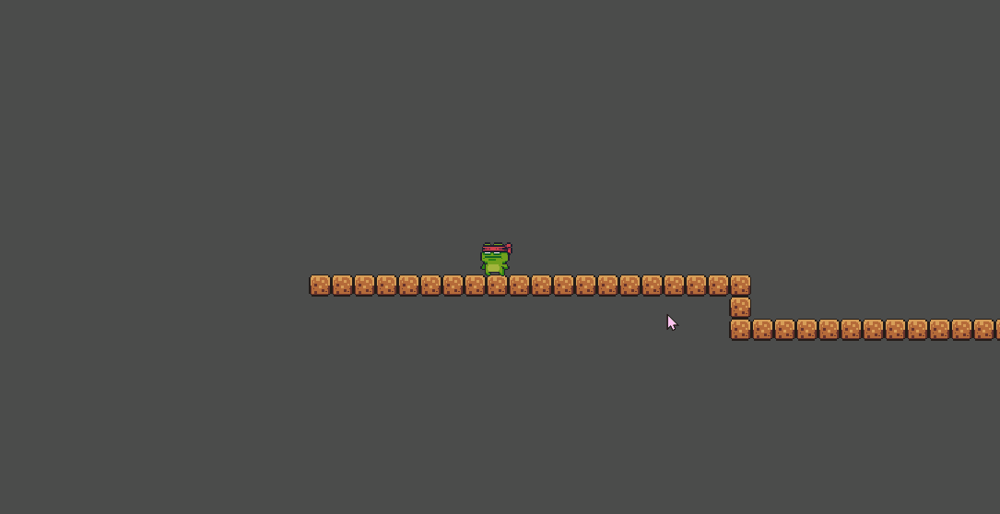
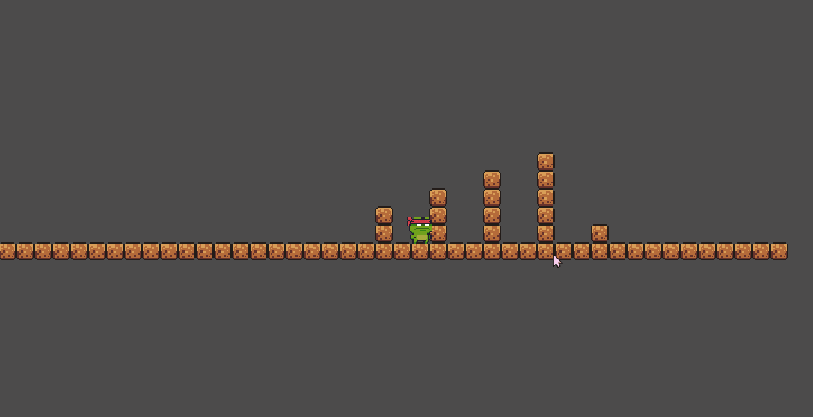
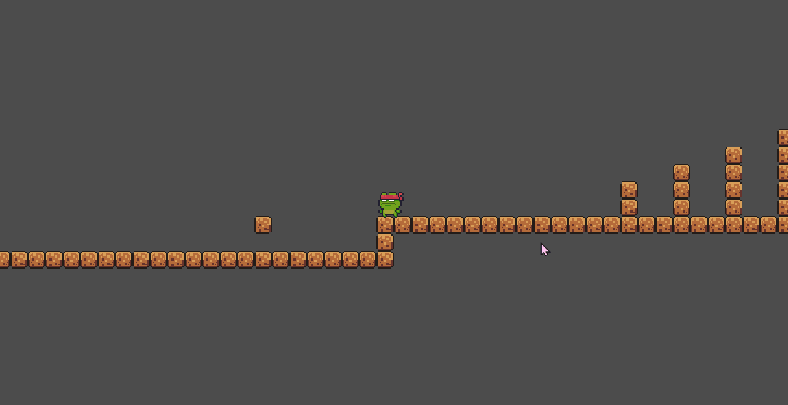
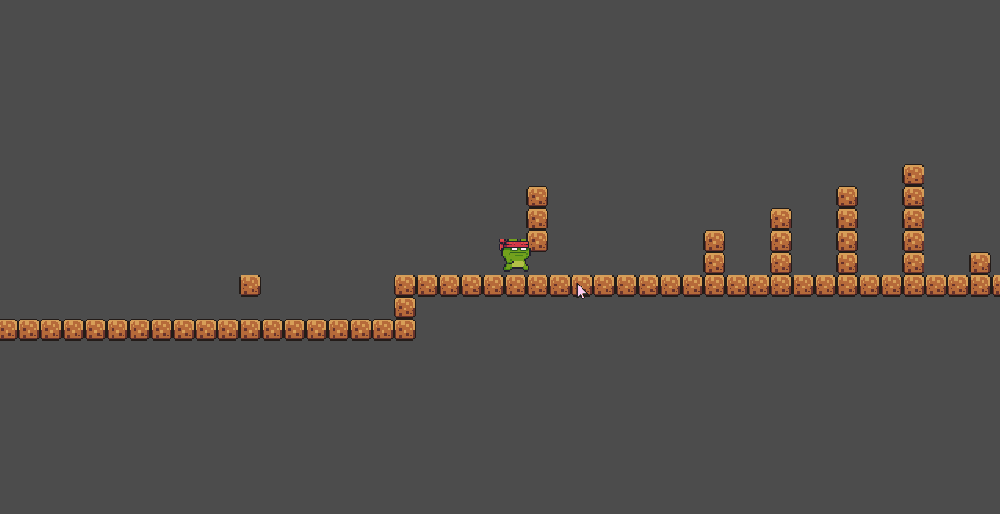
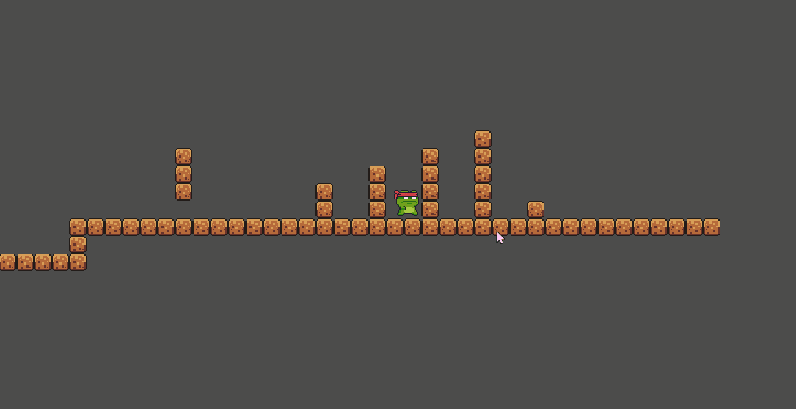
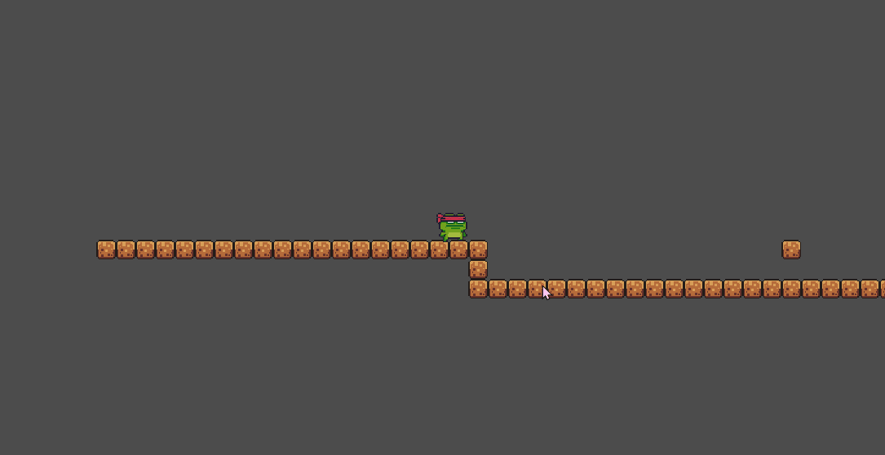
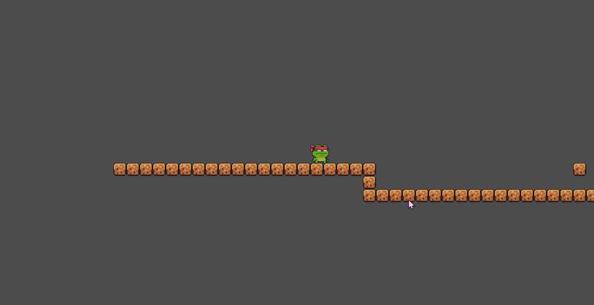

# move-jump-and-roll
 A platform jumping game made using Godot
### 移动
按AD键左右移动

### 跳跃
按K键可以跳跃，可以跳过两格高

### 蓝滚
按L键可以翻滚，可以通过翻滚过仅一格高的空间，翻滚期间移动速度略微提高，并且受重力影响减少，在跳跃后翻滚可以跳的更高

### 紫滚
蓝滚期间跳跃触发紫滚，继承蓝滚的一切特性，跳跃高度降低，但是速度十分快，可以跨过很远的距离

### 金滚
在蓝滚后不立即跳跃，可以在紫滚期间再一次进行翻滚，触发金滚，金滚期间无法改变移动方向  
